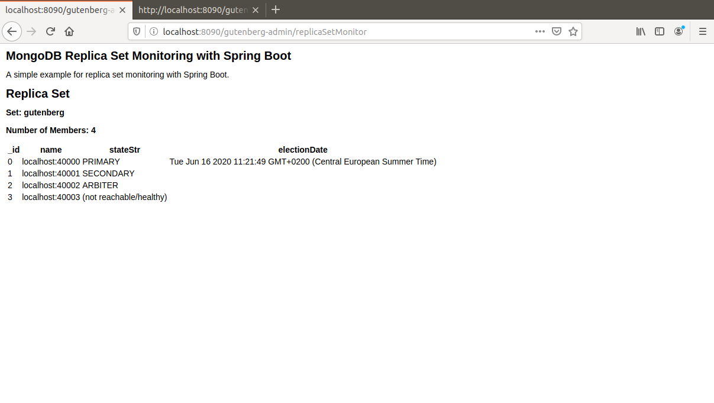

# gutenberg-replica
A MongoDB based e-commerce site demo with Spring Boot support and replication.

I present here a MongoDB based e-commerce web site demo. The focus is on MongoDB Spring Boot support. The prequisites for running this project are:

A recent Maven version.
A recent Spring Boot version (I use version 2.3).
A recent MongoDB version (I use v4.2.7).

The database gutenbergRS used in this demo can be prepopulated using the attached Javascript file gutenbergRS.js. It has to be loaded on port 40000 after the initialization of the replica set. A separate database named gutenbergAdmin is used for authentication only on default port 27017. It can be prepopulated using the file gutenbergAdmin.js. 

Some users are preregistered. Their names and raw passwords are listed below:

| username | password  |
| -------- |---------- |
| Carol    | s1a2t3o4r |
| Albert   | a5r6e7p8o |
| Werner   | t4e3n2e1t |
| Alice    | o8p7e6r5a |
| Richard  | r1o2t3a4s |

Five collections are used:

categories: book categories

books: books

orders: orders to be placed or already placed on this site

user: users registered to this site

reviews: reviews of books written by registered users

All orders can be persisted with a state that can be: CART, PRE\_AUTHORIZE, PRE\_SHIPPING, SHIPPED

A user can see other books most frequently bought with the books she plans to buy. A user can vote for the reviews written for these books

The main application can be access through a browser on localhost:8080/gutenberg

In addition to the main application a standalone application GutenbergReplicaMonitor displays the current status of the replica set. It runs on a different port 8090 with context path gutenberg-admin. Stomp over websockets is used for status display.
The monitor can be accessed through a browser on localhost:8090/gutenber-admin

Here are the steps to run the complete application.

1. Start the MongoDB replica set

In home directory create subdirectories named ~/node1, ~/node2, ~/node3, ~/arbiter

Run the commands in separate terminals:

`mongod --replSet gutenberg --dbpath ~/node1 --port 40000`
`mongod --replSet gutenberg --dbpath ~/node2 --port 40001`
`mongod --replSet gutenberg --dbpath ~/arbiter --port 40002`
`mongod --replSet gutenberg --dbpath ~/node3 --port 40003`

Connect to mongod server on port 40000 using `mongo --port 40000` and run the command in mongo client shell:
`>rs.initiate()`

Then in the same way run the commands:
`rs.add("localhost:40001")`
`rs.add("localhost:40002", {arbiterOnly : true})`
`rs.add("localhost:40003")`

Then prepopulate the database:
`load("gutenbergRS.js")`

2. Prepopulate admin database

Connect to default MongoDB port 27017. In mongo shell run the command: `load("gutenbergAdmin.js")`

3. Start the applications

In subdirectories GutenbergReplica and GutenbergReplicaMonitor run the command:
`mvn spring-boot:run`

Then open two different browsers and hit URIs localhost:8080/gutenberg in one and localhost:8090/gutenberg-admin in the other;

Then experiment by shutting down and restarting some nodes.

Here are some screen shots that can be seen during an application run:

For a video demo of this project follow this link:

https://youtu.be/5qGvYdfYLng 

